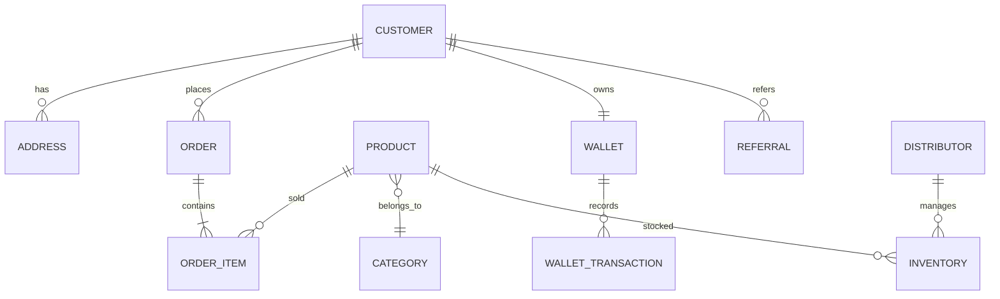

# ER Diagram (High Level)

```mermaid
erDiagram
CUSTOMER ||--o{ ADDRESS : has
CUSTOMER ||--o{ ORDER : places
ORDER ||--|{ ORDER_ITEM : contains
PRODUCT ||--o{ ORDER_ITEM : sold
CUSTOMER ||--|| WALLET : owns
WALLET ||--o{ WALLET_TRANSACTION : records
CUSTOMER ||--o{ REFERRAL : refers
PRODUCT }o--|| CATEGORY : belongs_to
DISTRIBUTOR ||--o{ INVENTORY : manages
PRODUCT ||--o{ INVENTORY : stocked
```
